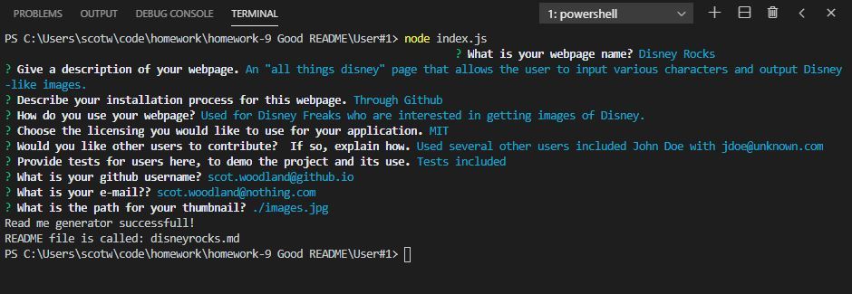
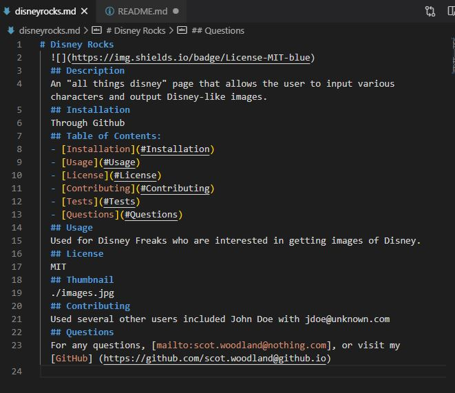

# GoodReadme_Generator
  
  ## Description 
  Using Node, this application creates a basic README file based upon user answers from input questions presented. The README file name is user generated and allows for multiple sections to be introduced into the README. The file uses the node module "require" which is included in the "node modules" folder. 
  ## Installation
  Begin by installing Node using Terminal. Then, further install the nodes by typing in "npm init" and then "npm install require". 
  ## Usage
 To run, type "node index.js" in the terminal line. The terminal will return a series of questions to answer. (To leave a line blank, simply press 'enter'.)
 
 
 
 

[Github Repository:](https://github.com/scotwoodland/Good_Readme/)

[Video Demonstration:](https://drive.google.com/file/d/1KKC_uEVCvuL2_VMvJH1H7SgUFHtxVrtl/view)
 
  ## License
  MIT
  